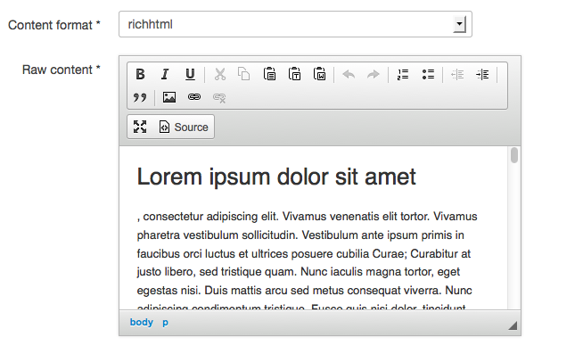
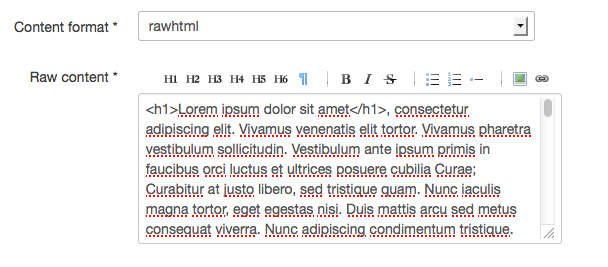

.. index::
    double: Widget; Usage
    double: Widget; Configuration

One recurrent need is to provide some kind of rich user interface to
edit content.
However, depending on the final target the content can have different
formats: ``markdown``, ``textile``, ``bbcode``, ``rawhtml``, or
``richhtml``.

Simple Formatter Widget
=======================

The ``Sonata\FormatterBundle\Form\Type\SimpleFormatterType`` widget has
been implemented to allow developers to force the input formatter value::

    use Sonata\FormatterBundle\Form\Type\SimpleFormatterType;

    $formMapper
        ->add('comment', SimpleFormatterType::class, [
            'format' => 'markdown',
            'ckeditor_context' => 'default', // optional
        ]);

Advanced Formatter Widget
=========================

The ``Sonata\FormatterBundle\Form\Type\FormatterType`` widget has been
implemented to allow end users to select the correct format for their
need.  And depending on the format, the textarea will change to match
its requirements.

By default, the widget supports these types:

* `text` with a standard textarea widget;
* `markdown` with `Markdow MarkItUp! <http://markitup.jaysalvat.com/examples/markdown/>`_;
* `rawhtml` with `HTML MarkItUp! <http://markitup.jaysalvat.com/examples/html/>`_;
* `richhtml` with `CKEditor <http://ckeditor.com/>`_.

Preview
-------

   The formatter with CKEditor

   The formatter with MarkItUp!

How to use it ?
---------------

In order to make it work, let us take a real life example: "a post from a
blog can have different input formats".
So, the post model requires the following fields:

* a ``contentFormatter`` field: store the selected formatter;
* a ``rawContent`` field: store the original content from the user;
* a ``content`` field: store the transformed content display to the visitor.

Now, let us define a form to edit this post::

    use Sonata\FormatterBundle\Form\Type\FormatterType;

    $formBuilder
        ->add('content', FormatterType::class, [
            'event_dispatcher' => $formBuilder->getEventDispatcher(),
            'format_field'   => 'contentFormatter',
            'format_field_options' => [
                'choices' => [
                    'text' => 'Text',
                    'markdown' => 'Markdown',
                ],
                'data' => 'markdown',
            ],
            'source_field' => 'rawContent',
            'source_field_options' => [
                'attr' => ['class' => 'span10', 'rows' => 20],
            ],
            'listener' => true,
            'target_field' => 'content',
        ]);

The form type defines a ``contentFormatter`` with a select choice
(``sonata_formatter_type_selector``).
The available formatter choices are ``text`` and ``markdown`` here, with
the ``markdown`` formatter preselected.
The ``Sonata\FormatterBundle\Form\Type\FormatterType`` takes various
options:

* ``listener`` (optional, default is ``true``);
* ``event_dispatcher``: the form dispatcher to attach the "submit" event
  (optional, depends on the ``listener`` value);
* ``format_field``: the entity's format field;
* ``format_field_options``: the format field options (optional);
* ``source_field``: the entity's source field;
* ``source_field_options``: the source field options (optional);
* ``target_field``: the entity's final field with the transformed data.

Additionally, the following options can be added to give ``CKEditor`` a
context in order to select images directly from ``SonataMediaBundle``,
and to define a custom ``CKEditor`` toolbar configuration:

* ``ckeditor_context``: give CKEditor a context in order to customize
  routes used to browse and upload medias (see "Use CKEditor to select
  medias in SonataMediaBundle" chapter)
* ``ckeditor_toolbar_icons`` : give CKEditor a custom toolbar
  configuration (optional)

Here is the default ``CKEditor`` custom toolbar configuration, you can tweak::

    $ckeditor_toolbar_icons = [
        1 => ['Bold', 'Italic', 'Underline',
            '-', 'Cut', 'Copy', 'Paste', 'PasteText', 'PasteFromWord',
            '-', 'Undo', 'Redo',
            '-', 'NumberedList', 'BulletedList', '-', 'Outdent', 'Indent',
            '-', 'Blockquote',
            '-', 'Image', 'Link', 'Unlink', 'Table'],
        2 => ['Maximize', 'Source'],
    ];

If you stop here, the most interesting part will not be present. Let's
edit some configuration files.

.. note::

    If you want to see an actual implementation of this can, you can
    have a look at the ``SonataNewsBundle``.

Sonata Admin Integration
------------------------

To use this feature with SonataAdmin, add or extend the following lines to your config:

.. code-block:: yaml

    # config/packages/sonata_admin.yaml

    sonata_admin:
        assets:
            extra_javascripts:
                - bundles/fosckeditor/ckeditor.js
                - bundles/sonataformatter/vendor/markitup-markitup/markitup/jquery.markitup.js
                - bundles/sonataformatter/markitup/sets/markdown/set.js
                - bundles/sonataformatter/markitup/sets/html/set.js
                - bundles/sonataformatter/markitup/sets/textile/set.js

            extra_stylesheets:
                - bundles/sonataformatter/markitup/skins/sonata/style.css
                - bundles/sonataformatter/markitup/sets/markdown/style.css
                - bundles/sonataformatter/markitup/sets/html/style.css
                - bundles/sonataformatter/markitup/sets/textile/style.css
